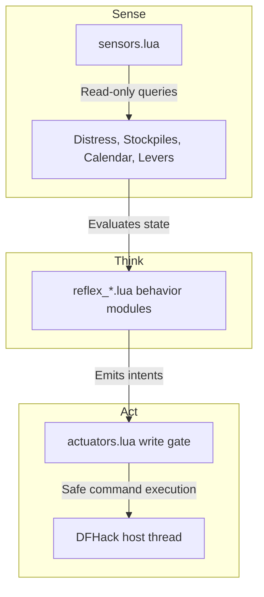

# DwarfMind 🧠⛏️

**DwarfMind** is a fully autonomous agent framework for **Dwarf Fortress**, built on top of **DFHack's Lua API**. 

Designed as a decentralized cognitive system, DwarfMind continuously monitors your fortress state, coordinates industry pipelines, and automatically resolves life-and-death crises. It is engineered with **Safety First** as its core design principle, protecting your host game threads from blocking, crashes, and save-corruption.

---

## 📖 Key Architectural Philosophy

Every module in DwarfMind adheres to the strict **Sense-Think-Act** pattern:



### 🛡️ Defensive Core Constraints
1. **Zero Blocking Loops (`while true`)**: All tasks run on non-blocking intervals driven by `repeat-util` via the game's ticks scheduler.
2. **Crash Prevention**: All reads, global references, and API invocations are safely wrapped in `pcall` logic.
3. **Validating Actuators**: State changes are executed via official DFHack console commands and scripts (`dfhack.run_script`) to ensure DFHack's native validation rules run.
4. **Dry Run Guard**: Every actuator command is routed through a `dry_run` safety gate. In dry-run mode (default `true`), DwarfMind logs detailed actions but does not mutate the game state, allowing you to safely test against a live fort.

---

## ⚡ Core Reflexes & Capabilities

DwarfMind coordinates a vast ecosystem of automated cognitive reflexes:

| Component | Reflex | Role & Behavior |
|---|---|---|
| **Starvation & Supply** | `reflex_production` | Monitors stock levels and auto-queues work orders for food, drink, and seeds. |
| **Medical** | `reflex_medical` | Audits Chief Medical Dwarf office and hospital supply buffers (splints, crutches, soap, plaster, buckets). |
| **Stress & Burrows** | `reflex_stress` | Tracks stressed citizens and automatically checks them into the **Respite Spa**, disabling labors to allow relaxation and restoring them on recovery. |
| | `reflex_burrow` | Automatically triggers civilian panic alerts and routes citizens to burrows during hostiles. |
| **Lunar Quarantine** | `reflex_quarantine` | Automatically tracks citizens infected with lycanthropy, calculates calendar dates based on moon phases (28-day cycle), and locks bedroom doors on days 25-28 to isolate transformations. |
| **Burials & Graves** | `reflex_cemetery` <br> `reflex_cemetery_slab` | Monitors dead citizens, orders coffins/tombs, downcasts slab pointers, and automates memorial engraving to prevent ghost rampages. |
| **Trade & Economy** | `reflex_trade` | Detects caravans, locates the depot, and auto-marks finished goods, gems, toys, and instruments for transport. |
| **Farming & Forestry** | `reflex_farming` <br> `reflex_woodcutter` | Controls DFHack autofarm configurations and dynamically scales the C++ autochop plugin based on wood log stockpiles. |
| **Workshop Clutter** | `reflex_garbage` | Identifies cluttered workshops and schedules item dumps to prevent production blocks. |
| **Military Gear** | `reflex_military_gear` | Audits military squad sizes and automatically queues work orders for missing weapons and armor. |
| **Hydrology Level** | `reflex_hydrology` | Monitors liquid depth at sensor tiles and flips cistern inlet/outlet gates automatically to maintain safe water levels. |

---

## ⚙️ Usage & CLI Commands

DwarfMind commands are executed directly in the **DFHack console**:

*   **`enable dwarfmind`** (or `dwarfmind enable`): Arms the repeating perception and planning cadences and hooks the game lifecycle.
*   **`disable dwarfmind`** (or `dwarfmind disable`): Safely disarms all cadences and invalidates cache states.
*   **`dwarfmind status`**: Displays active loop cadences, scheduling details, and system health status.
*   **`dwarfmind debug`**: Switches structured logging threshold to `DEBUG` verbosity.
*   **`dwarfmind info`**: Restores structured logging threshold to `INFO` (default).
*   **`dwarfmind warn`**: Sets logging threshold to `WARN`.

---

## 📁 Repository Structure

```
dwarfmind/
├── ARCHITECTURE.md                          # Comprehensive design details & specs
├── actuators.lua                           # Safe gate for game-state mutation
├── ai_core.lua                             # Main scheduler & lifecycle manager
├── logger.lua                              # Structured, tag-aware logging engine
├── sensors.lua                             # Read-only queries & performance caching
├── reflex_*.lua                            # Modulized behavior modules
└── dwarfmind_dfstructures_reference.md     # Reference guide to DFHack structures
```

---

## 🛠️ Developer Setup & Extending DwarfMind

Every behavior in DwarfMind is a self-contained module. To create a new reflex:

1. Create a new file `reflex_my_feature.lua` in `dwarfmind/`.
2. Define the script header module context:
   ```lua
   --@ module = true
   local _ENV = mkmodule('dwarfmind/reflex_my_feature')
   local sensors = reqscript('dwarfmind/sensors')
   local actuators = reqscript('dwarfmind/actuators')
   local log = reqscript('dwarfmind/logger').for_module('reflex_my_feature')

   function run()
       -- 1. Read state
       local count, ok = sensors.get_some_data()
       if not ok then return end

       -- 2. Think & Act
       if count < 10 then
           actuators.run_script('workorder', 'MyJob', '1')
       end
   end

   function reset()
       -- Clean up state on reload
   end

   return _ENV
   ```
3. Register the new reflex import at the top of [dwarfmind/ai_core.lua](file:///home/mikey/Games/DwarfFortress/hack/scripts/dwarfmind/ai_core.lua) and include it in the execution loop inside `tick_slow()` or `tick_fast()`.
