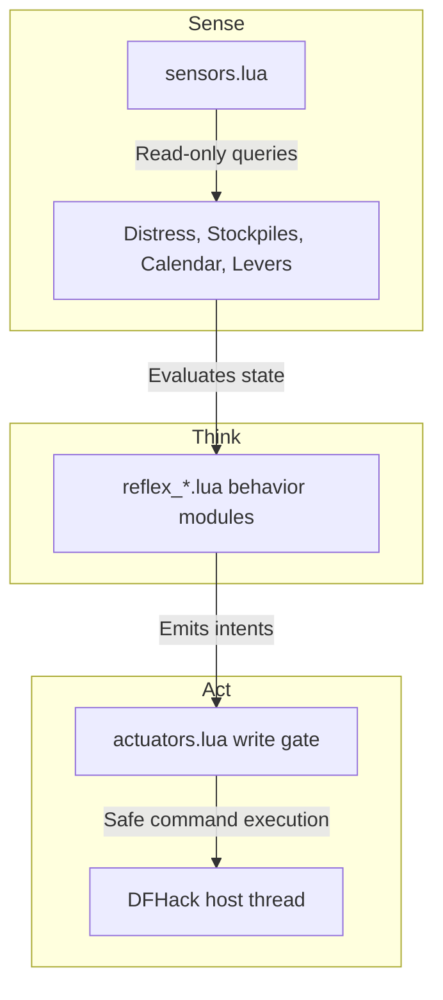

# DwarfMind 🧠⛏️

**DwarfMind** is a fully autonomous agent framework for **Dwarf Fortress**, built on top of **DFHack's Lua API**. 

Designed as a decentralized cognitive system, DwarfMind continuously monitors your fortress state, coordinates industry pipelines, and automatically resolves life-and-death crises. It is engineered with **Safety First** as its core design principle, protecting your host game threads from blocking, crashes, and save-corruption.

---

## 📖 Key Architectural Philosophy

Every module in DwarfMind adheres to the strict **Sense-Think-Act** pattern:



### 🛡️ Defensive Core Constraints
1. **Zero Blocking Loops (`while true`)**: All tasks run on non-blocking intervals driven by `repeat-util` via the game's ticks scheduler.
2. **Crash Prevention**: All reads, global references, and API invocations are safely wrapped in `pcall` logic.
3. **Validating Actuators**: State changes are executed via official DFHack console commands and scripts (`dfhack.run_script`) to ensure DFHack's native validation rules run.
4. **Dry Run Guard**: Every actuator command is routed through a `dry_run` safety gate. In dry-run mode (default `true`), DwarfMind logs detailed actions but does not mutate the game state, allowing you to safely test against a live fort.

---

## ⚡ Core Reflexes & Capabilities

DwarfMind coordinates a comprehensive ecosystem of automated cognitive reflexes, categorized by system domain:

### 🛡️ Fortress Defense & Safety
| Script | Category | Role & Behavior |
|---|---|---|
| `reflex_defense` | Tactical defense | Auto-pulls registered defense levers (named gate, bridge, panic, entrance, etc.) when hostile units are detected. |
| `reflex_burrow` | Civilian safety | Restricts civilians to the "Safety" or "Panic" burrow during invasions; automatically lifts the restriction 600 ticks after the map is clear. |
| `reflex_access_security` | Tactical defense | Manages security gate/drawbridge states: seals the fort during invasions, and opens gates for incoming caravans in peacetime. |

### 🩺 Health, Stress & Wellness
| Script | Category | Role & Behavior |
|---|---|---|
| `reflex_distress` | Wellness monitoring | Audits citizen health indicators (hunger, thirst, sleepiness, pain, bleeding, hospitalization status, strange moods) and logs warnings. |
| `reflex_stress` | Mental health | Safely sends stressed citizens to the "Respite" spa burrow and suspends labors; restores original labors upon recovery. |
| `reflex_medical` | Medical logistics | Audits Chief Medical Dwarf assignee status and hospital supply buffers (splints, crutches, soap, plaster, buckets) to queue production. |
| `reflex_soap_chain` | Medical logistics | Coordinates the ash, lye, and soap production chain to maintain a buffer of 10 soaps in the hospital. |
| `reflex_clothing` | Hygiene logistics | Ensures the C++ `tailor` plugin is active to automatically replace tattered, worn clothing and manage textile stock. |

### 🛠️ Industry, Farming & Resources
| Script | Category | Role & Behavior |
|---|---|---|
| `reflex_production` | Basic supplies | Audits food, drink, and seed counts; queues work orders for brewing and meal preparation. |
| `reflex_seedwatch` | Farming safety | Bans kitchen cooking of plump helmets when seed counts drop below 20; lifts the ban when seeds recover above 50. |
| `reflex_farming` | Crop management | Automatically enables and configures C++ `autofarm` crop thresholds for all underground seeds. |
| `reflex_woodcutter` | Forestry control | Dynamically enables and configures C++ `autochop` to cut logs when wood is low (<15) and suspends it when wood is healthy (>40) to prevent deforestation. |
| `reflex_beds` | Citizen housing | Monitors bedroom furniture counts and automatically queues `ConstructBed` work orders to meet housing deficits. |
| `reflex_auto_container` | Basic supplies | Audits empty barrels and stone pots in stock, ordering new container production if empty stock is low (<10). |
| `reflex_mood_helper` | Strange moods | Automatically solves strange mood material bottlenecks by enabling autochop (wood), slaughtering excess animals (bone/leather), smelting ore (metal), or weaving thread (cloth). |

### 🐑 Livestock & Husbandry
| Script | Category | Role & Behavior |
|---|---|---|
| `reflex_butcher` | Population control | Groups livestock by species and automatically marks excess adults for slaughter, prioritizing males while preserving breeding pairs. |
| `reflex_geld` | Population control | Audits species numbers and gelds younger male livestock to prevent population explosions, keeping the oldest male for breeding. |
| `reflex_pasture` | Grazing allocation | Automatically assigns unpastured grazing livestock to the first defined Pen/Pasture activity zone. |
| `reflex_vermin_control` | Pet population control | Monitors adult cat populations and marks excess for slaughter while preserving a breeding pair, preventing FPS-killing cat explosions. |

### 🪦 Graves & Cemetery Management
| Script | Category | Role & Behavior |
|---|---|---|
| `reflex_cemetery` | Funeral logistics | Audits dead and unburied citizen counts; queues `ConstructCoffin` work orders and runs the `burial` zoner script. |
| `reflex_cemetery_slab` | Memorial logistics | Monitors blank stone slabs, enables the `autoslab` plugin, and orders slab crafting to prevent ghost rampages. |
| `reflex_cleanup` | Fortress hygiene | Claims forbidden rotting carcasses and remains inside the subterranean fortress to prevent miasma. |

### 💰 Economy, Noble Demands & Clutter
| Script | Category | Role & Behavior |
|---|---|---|
| `reflex_trade` | Caravan logistics | Detects caravans AtDepot and automatically marks finished goods, toys, instruments, and cut gems for trade. |
| `reflex_noble_demands` | Room & mandate audit | Satisfies Appointed Noble room and luxury furniture requirements; auto-queues work orders for mandated items. |
| `reflex_garbage` | Workshop throughput | Identifies highly cluttered workshops (>8 items) and automatically marks finished goods for dumping to prevent production stalls. |

### ⚙️ Services & Infrastructure Control
| Script | Category | Role & Behavior |
|---|---|---|
| `reflex_idle` | Labor audit | Identifies and logs idle citizens to help track labor allocation gaps. |
| `reflex_hydrology` | Cistern safety | Monitors cistern/reservoir water depth at configured sensor coordinates and automatically triggers inlet/outlet floodgates. |
| `reflex_military_gear` | Squad logistics | Audits squad positions and automatically orders weapons, shields, breastplates, greaves, and helmets to fill deficits. |
| `reflex_siege_ammo` | Ammunition logistics | Audits squad sizes against stockpiled/queued bolts and siege ammo, and queues `MakeAmmo` / `AssembleSiegeAmmo` work orders using the dominant available metal. |
| `reflex_quarantine` | Werebeast quarantine | Tracks lycanthropy-infected citizens and automatically locks bedroom doors on full-moon days (25-28) of the 28-day cycle, releasing them on day 1. |
| `reflex_justice` | Law enforcement audit | Monitors Sheriff / Captain of the Guard appointment, jailed prisoner wellness, and available justice restraints (chains/cages); logs critical warnings. |

---

## ⚙️ Usage & CLI Commands

DwarfMind commands are executed directly in the **DFHack console**:

*   **`enable dwarfmind`** (or `dwarfmind enable`): Arms the repeating perception and planning cadences and hooks the game lifecycle.
*   **`disable dwarfmind`** (or `dwarfmind disable`): Safely disarms all cadences and invalidates cache states.
*   **`dwarfmind status`**: Displays active loop cadences, scheduling details, and system health status.
*   **`dwarfmind debug`**: Switches structured logging threshold to `DEBUG` verbosity.
*   **`dwarfmind info`**: Restores structured logging threshold to `INFO` (default).
*   **`dwarfmind warn`**: Sets logging threshold to `WARN`.

---

## 📁 Repository Structure

```
dwarfmind/
├── ARCHITECTURE.md                          # Comprehensive design details & specs
├── actuators.lua                           # Safe gate for game-state mutation
├── ai_core.lua                             # Main scheduler & lifecycle manager
├── logger.lua                              # Structured, tag-aware logging engine
├── sensors.lua                             # Read-only queries & performance caching
├── reflex_*.lua                            # Modulized behavior modules
└── dwarfmind_dfstructures_reference.md     # Reference guide to DFHack structures
```

---

## 🛠️ Developer Setup & Extending DwarfMind

Every behavior in DwarfMind is a self-contained module. To create a new reflex:

1. Create a new file `reflex_my_feature.lua` in `dwarfmind/`.
2. Define the script header module context:
   ```lua
   --@ module = true
   local _ENV = mkmodule('dwarfmind/reflex_my_feature')
   local sensors = reqscript('dwarfmind/sensors')
   local actuators = reqscript('dwarfmind/actuators')
   local log = reqscript('dwarfmind/logger').for_module('reflex_my_feature')

   function run()
       -- 1. Read state
       local count, ok = sensors.get_some_data()
       if not ok then return end

       -- 2. Think & Act
       if count < 10 then
           actuators.run_script('workorder', 'MyJob', '1')
       end
   end

   function reset()
       -- Clean up state on reload
   end

   return _ENV
   ```
3. Register the new reflex import at the top of [dwarfmind/ai_core.lua](file:///home/mikey/Games/DwarfFortress/hack/scripts/dwarfmind/ai_core.lua) and include it in the execution loop inside `tick_slow()` or `tick_fast()`.
